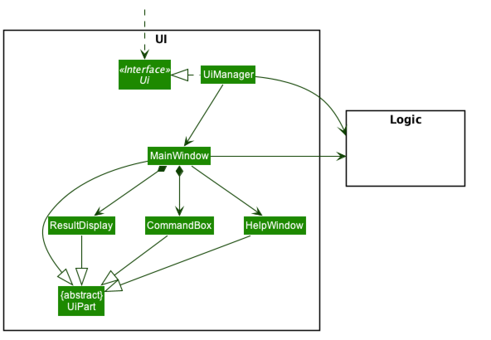
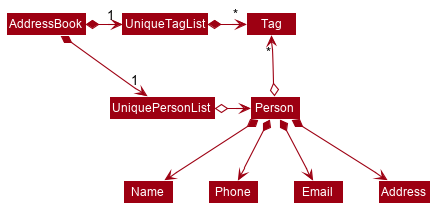

## Table of Contents
<!--ts-->
* [Design](#design)
* [Product Scope](#product-scope)
* [User Stories](#user-stories)
* [Use Cases](#use-cases)
  * [Calculate BMI](#use-case-calculate-bmi)
  * [Query height and weight](#use-case-query-height-and-weight)
  * [Update height and weight](#use-case-update-height-and-weight)
  * [Add food item as consumption](#use-case-add-food-item-as-consumption)
  * [Get diet recommendation](#use-case-get-diet-recommendation)
  * [View diet plan](#use-case-view-diet-plan)
  * [Add food item as an intake](#use-case-add-food-item-as-an-intake)
  * [Display current food intake for the day](#use-case-display-current-food-intake-for-the-day)
* [Non-Functional Requirements](#non-functional-requirements)
* [Glossary](#glossary) 
<!--te-->

## **Design**

### Architecture

The ***Architecture Diagram*** given above explains the high-level design of the App. Given below is a quick overview of each component.

**`Main`** has two classes called [`Main`](https://github.com/se-edu/addressbook-level3/tree/master/src/main/java/seedu/address/Main.java) and [`MainApp`](https://github.com/se-edu/addressbook-level3/tree/master/src/main/java/seedu/address/MainApp.java). It is responsible for,
* At app launch: Initializes the components in the correct sequence, and connects them up with each other.
* At shut down: Shuts down the components and invokes cleanup methods where necessary.

[**`Commons`**](#common-classes) represents a collection of classes used by multiple other components.

The rest of the App consists of four components.

* [**`UI`**](#ui-component): The UI of the App.
* [**`Logic`**](#logic-component): The command executor.
* [**`Model`**](#model-component): Holds the data of the App in memory.
* [**`Storage`**](#storage-component): Reads data from, and writes data to, the hard disk.

Each of the four components,

* defines its *API* in an `interface` with the same name as the Component.
* exposes its functionality using a concrete `{Component Name}Manager` class (which implements the corresponding API `interface` mentioned in the previous point.

For example, the `Logic` component (see the class diagram given below) defines its API in the `Logic.java` interface and exposes its functionality using the `LogicManager.java` class which implements the `Logic` interface.

**How the architecture components interact with each other**

The *Sequence Diagram* below shows how the components interact with each other for the scenario where the user issues the command `delete 1`.

The sections below give more details of each component.

### UI component

**API** :
[`Ui.java`](https://github.com/se-edu/addressbook-level3/tree/master/src/main/java/seedu/address/ui/Ui.java)

The UI consists of a `MainWindow` that is made up of parts e.g.`CommandBox`, `ResultDisplay`, `PersonListPanel`, `StatusBarFooter` etc. All these, including the `MainWindow`, inherit from the abstract `UiPart` class.

The `UI` component uses JavaFx UI framework. The layout of these UI parts are defined in matching `.fxml` files that are in the `src/main/resources/view` folder. For example, the layout of the [`MainWindow`](https://github.com/se-edu/addressbook-level3/tree/master/src/main/java/seedu/address/ui/MainWindow.java) is specified in [`MainWindow.fxml`](https://github.com/se-edu/addressbook-level3/tree/master/src/main/resources/view/MainWindow.fxml)

The `UI` component,

* Executes user commands using the `Logic` component.
* Listens for changes to `Model` data so that the UI can be updated with the modified data.

### Logic component

**API** :
[`Logic.java`](https://github.com/se-edu/addressbook-level3/tree/master/src/main/java/seedu/address/logic/Logic.java)

1. `Logic` uses the `AddressBookParser` class to parse the user command.
1. This results in a `Command` object which is executed by the `LogicManager`.
1. The command execution can affect the `Model` (e.g. adding a person).
1. The result of the command execution is encapsulated as a `CommandResult` object which is passed back to the `Ui`.
1. In addition, the `CommandResult` object can also instruct the `Ui` to perform certain actions, such as displaying help to the user.

Given below is the Sequence Diagram for interactions within the `Logic` component for the `execute("delete 1")` API call.

:information_source: **Note:** The lifeline for `DeleteCommandParser` should end at the destroy marker (X) but due to a limitation of PlantUML, the lifeline reaches the end of diagram.

### Model component

**API** : [`Model.java`](https://github.com/se-edu/addressbook-level3/tree/master/src/main/java/seedu/address/model/Model.java)

The `Model`,

* stores a `UserPref` object that represents the user’s preferences.
* stores the address book data.
* exposes an unmodifiable `ObservableList<Person>` that can be 'observed' e.g. the UI can be bound to this list so that the UI automatically updates when the data in the list change.
* does not depend on any of the other three components.

:information_source: **Note:** An alternative (arguably, a more OOP) model is given below. It has a `Tag` list in the `AddressBook`, which `Person` references. This allows `AddressBook` to only require one `Tag` object per unique `Tag`, instead of each `Person` needing their own `Tag` object. 

### Storage component

**API** : [`Storage.java`](https://github.com/se-edu/addressbook-level3/tree/master/src/main/java/seedu/address/storage/Storage.java)

The `Storage` component,
* can save `UserPref` objects in json format and read it back.
* can save the address book data in json format and read it back.

### Common classes

Classes used by multiple components are in the `seedu.addressbook.commons` package.

--------------------------------------------------------------------------------------------------------------------

### Product Scope

**Target user profile**
  * want to start a diet
  * track their progress against a diet plan
  * track the macronutrients of the food consumed
  * is comfortable with command-line interface

**Value proposition**: quickly input daily food intake and calculate their macronutrients to check if diet plan is progressing as planned

### User Stories
Priorities: High (must have) - `***`, Medium (nice to have) - `**`, Low (unlikely to have) - `*`

|Priority|   As a ...   |   I want to ...  |   So that I can​ ...   |
|------------|------------------|----------------------|---------------------------|
|`***`|User|Set a deadline for my diet plan|Stay on track of when the diet finishes|
|`***`|User|Add a new diet plan|Start a new diet plan|
|`***`|User|Delete my diet plan|Give up on the current diet plan|
|`***`|User|Track my weight|See if the diet is working|
|`***`|User|View a list of recommended diets|find out what to diet on as I am not sure|
|`***`|First-time User|Skim through some example templates|Know how the application works|
|`**`|Long-time User|See a history of my past diet|I can backtrack what diets I have been on|
|`**`|Frequent user|Store information on the popular foods that I eat|Quickly input my intake for the day|
|`**`|User|Customize my diet plan|Adjust my diet plan to fit my needs|
|`**`|User with dietary requirements|Filter the list of diets to fit my dietary requirements|Choose diets that are suited to my dietary needs|
|`*`|Social Users|See/Give reviews on diets|Know which diets are more effective for others|
|`*`|Social Users|Connect with peers to see their dietary plans and progress|Stay up-to-date with my peers and possibly motivate myself|

*{More to be added}*

### Use Cases

(For all use cases below, the **Body Mass Index (BMI) Tracker** is the `BMITracker`, **Diet Plan Selector** is the `DietSelector`, **Macronutrients Tracker** is the `MacroTracker` and the **Actor** is the `user`, unless specified otherwise)

#### Use case: Calculate BMI

**MSS**

1.  User keys in the weight, height and ideal weight
2.  BMITracker calculates BMI from the user input
3.  BMITracker updates the height, weight and BMI of the user

    Use case ends.

#### Use case: Query height and weight

**MSS**

1.  User queries for height and weight
2.  BMITracker displays information for height and weight

    Use case ends.

#### Use case: Update height and weight

**MSS**

1.  User queries for height and weight
2.  BMITracker displays information for height and weight
3.  User updates the height and weight if they are different
4.  BMITracker updates the height, weight and BMI of the user

    Use case ends.

#### Use case: Add food item as consumption

**MSS**

1.  User keys in the date and food item with information such as its name, fats, carbos, proteins
2.  MacroTracker keeps track of that and calculates its kilocalories
3.  MacroTracker computes the total kilocalories for the day

    Use case ends.

#### Use case: Get diet recommendation

**MSS**

1.  User requests to get a list of diet recommendation
2.  DietSelector displays a list of diet recommendation based on user's BMI

    Use case ends.

#### Use case: View diet plan

**MSS**

1.  User requests for a certain diet type
2.  DietSelector displays a detailed requirement for that certain diet type

    Use case ends.

#### Use case: Add food item as an intake

**MSS**

1.  User adds a particular food item
2.  MacroTracker tracks the food and computes the total kilo calories consumption for the day

    Use case ends.

**Extensions**
*  1a. The food item exists.

   * 1a1. MacroTracker updates food item details in the list of food.

*  1b. The food item does not exists.

   * 1b1. MacroTracker adds the food item into the list of food.

   Use case resumes at step 2.

#### Use case: Display current food intake for the day

**MSS**

1.  User queries a particular day intake.
2.  MacroTracker displays the summary intake for that day.

    Use case ends.

*{More to be added}*

### Non-Functional Requirements

1.  Should work on any _mainstream OS_ as long as it has Java `11` or above installed.
2.  Should be able to hold diet plans for up to the past two years (730 days) without a noticeable sluggishness in performance for typical usage.
3.  A user with above average typing speed for regular English text (i.e. not code, not system admin commands) should be able to accomplish most of the tasks faster using commands than using the mouse.
4.  Should help users as they start the application for the first time with sample data.
5.  Interface should not hinder the users' usage of the application in order to input the data they need and get the desired response.
6.  The data files should be easily modifiable by a user with a basic understanding of the JavaScript Object Notation (JSON).
7.  Errors should display vividly and differently from the rest of the normal input such that users are aware something has gone wrong.
8.  Should be easily deployable to all systems running any _mainstream OS_ once compiled executable is distributed via a release.

*{More to be added}*

### Glossary

* **Mainstream OS**: Windows, Linux, Unix, OS-X
*{More to be added}*
